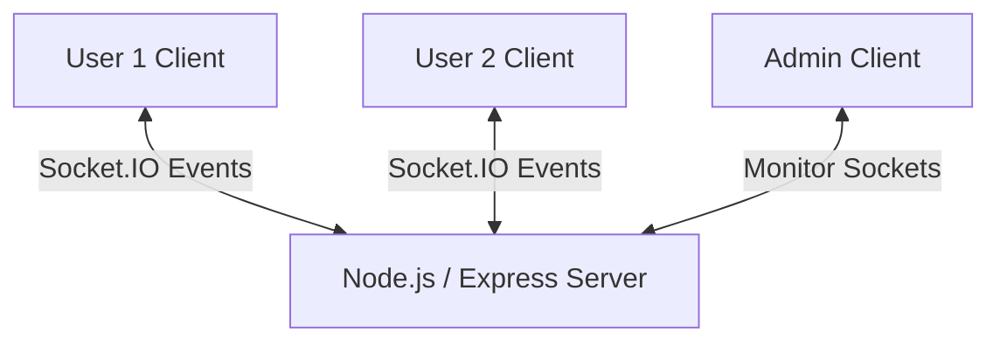

# Socket.IO Real-time Anonymous Chat 💬

## Overview
This repository contains a light-weight, real-time anonymous group messaging application. Built with Node.js, Express, and Socket.IO, the application features an instant chatroom interface where users can connect and chat immediately without registration or data tracking.

## Problem Statement
Most modern messaging systems require phone numbers, emails, or third-party authentication. This creates friction for temporary communication needs and raises privacy concerns. There is a need for a zero-friction, secure, and ephemeral messaging application that runs cleanly on any browser.

## Solution
This project implements an ephemeral WebSocket-based messaging system:
1. **Zero-Registration Entry**: Users enter a username and join a shared chatroom instantly.
2. **WebSocket Synchronization**: Leverages Socket.IO for bi-directional event emission.
3. **Admin Monitoring Controls**: Includes a built-in admin dashboard (`admin.html`) to manage socket connections and monitor active channel states.

## Features
* **Real-time Messaging**: Instant message delivery with sub-second latency.
* **Typing Indicators**: Visual feedback when other users are typing.
* **Active User Ticker**: Real-time counter showing the number of connected users.
* **Ephemerality**: Messages are kept in memory and never written to disk, ensuring complete privacy.

## Architecture
The application runs as a single-process event loop:



## Technology Stack
* **Frontend**: HTML5, Vanilla CSS3, JavaScript.
* **Backend**: Node.js, Express, Socket.IO.
* **Deployment**: Deployed on Render and Railway.

## Installation
### Prerequisites
* Node.js (v18+)

### Setup & Run
1. Clone the repository and navigate to the folder:
   ```bash
   git clone https://github.com/eswar1310/socket-anonymous-chat.git
   cd socket-anonymous-chat
   ```
2. Install npm packages:
   ```bash
   npm install
   ```
3. Start the application:
   ```bash
   npm start
   ```
4. Access the chat client in your browser at `http://localhost:3000`.
5. Access the administrative panel at `http://localhost:3000/admin.html`.

## Usage
* Open multiple browser tabs at `http://localhost:3000` to test local multi-user messaging.
* Type a message in the text box and press Enter or click Send.
* The typing indicator will appear for other users while you are typing.

## Results
* Ephemeral messaging pipeline running with sub-second latency.
* Clean admin view displaying socket IDs and active room connections.

## Screenshots
*(Provide links or placeholders to repository social previews)*
* **Chat Room Interface**: `[Insert Chatroom Screenshot]`
* **Admin Dashboard UI**: `[Insert Admin Screenshot]`

## Future Improvements
* Add support for multiple private chatrooms using Socket.IO rooms.
* Implement End-to-End Encryption (E2EE) using the Web Crypto API.
* Support sending images and small file attachments using WebRTC data channels.

## Project Structure
```text
socket-anonymous-chat/
├── admin.css              # Styling for admin dashboard
├── admin.html             # Admin interface
├── admin.js               # Admin logic and socket events
├── app.js                 # Chat interface script
├── check_ids.js           # Socket ID validation helper
├── index.html             # Main chatroom view
├── server.js              # Node.js/Express server config
├── styles.css             # Chatroom style sheets
├── package.json           # Project dependencies
└── README.md              # Main guide
```

## Contributing
See [CONTRIBUTING.md](CONTRIBUTING.md) for coding style guidelines.

## License
Distributed under the MIT License. See `LICENSE` for details.

## Contact
Eswar Melam - [LinkedIn](https://linkedin.com/in/eswar-melam) - eswar.melam@gmail.com
